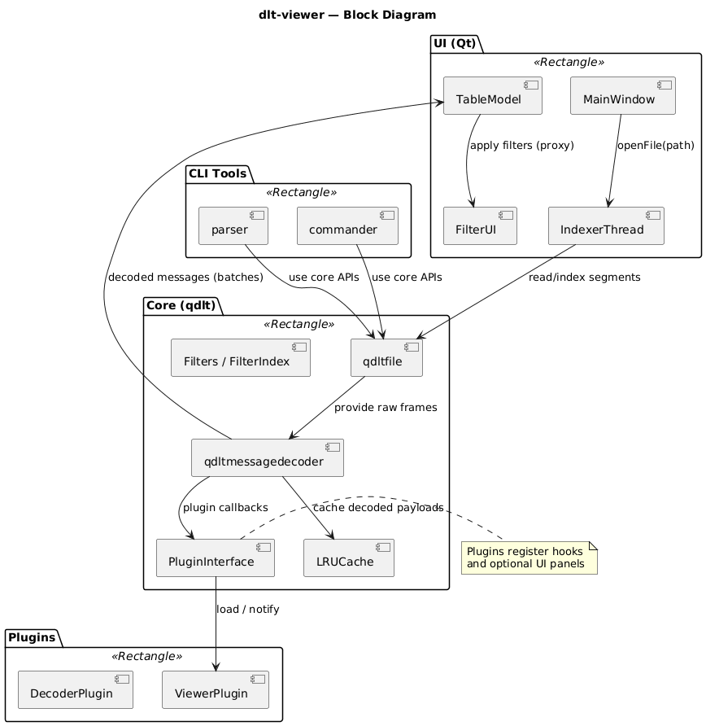

# High Level Design (HLD) — dlt-viewer

Version: 0.1

Author: Shubham.Shaha@bti.bmwgroup.com

Date: 09-02-2026

## 1. Purpose
Describe architecture, components, flows, interfaces and non‑functional requirements for dlt-viewer.

## 2. Scope
Covers repository at https://github.com/COVESA/dlt-viewer — core (qdlt), UI (src/parser), plugins, CLI tools, build & packaging.

## 3. Goals & Constraints

## 4. Stakeholders
Performance, extensibility, portability, observability, security considerations.

- UI (Qt): MainWindow, models, views, background indexer (src/, parser/)
- Plugins: extend decoding/viewing (plugin/)
- CLI: parser, commander (parser/, commander/)
- Build/Packaging: CMake + scripts

## 7. Component Responsibilities (high level)
- qdlt: qdltfile, qdltmessagedecoder, qdltfilter*, plugininterface.h
- UI: MainWindow, tablemodel, dltfileindexer, filterdialog, project persistence
- Plugins: implement plugininterface to register viewers/decoders
- CLI: batch parsing/export using qdlt core
- Packaging: scripts/, CMakePresets.json

## 8. Key Data Flows
- File open → qdltfile (indexing) → qdltmessagedecoder → dltmsgqueue → TableModel → UI (Filter proxy)
- Plugin load → plugin registers hooks → decoder/UI invokes plugin callbacks → plugin augments UI/metadata

## 9. Interfaces & Contracts
- Public API: headers in qdlt/ (document exported functions/types)
- Plugin interface: qdlt/plugininterface.h — define lifecycle, threading expectations
- Indexer ↔ UI: Qt signals/slots and message queue (document names/payloads)

## 10. Concurrency Model
- Indexing & decoding: worker threads
- UI: Qt main thread; updates via queued signals/slots
- Plugins: must be thread-safe — document callback thread context

## 11. Persistence & Configuration
- Project files & filters stored via src/project.* and filters/*.dlf
- DLT-Viewer settings persisted via QDltSettingsManager (qdlt/qdltsettingsmanager.*) into an INI file (default: ~/.dlt/config/config.ini)
- Plugin settings persisted in two layers:
	- Global plugin-related settings (e.g., plugin search path, autoload path) stored in the same config.ini via QDltSettingsManager
	- Per-project plugin list/mode/type and execution priority stored inside the project file (src/project.*)
	- Plugin-specific configuration files may be managed by the plugin itself (e.g., INI-style configs in plugin/*)
- Window state persisted as UI geometry and dock/widget state (geometry + windowState) via QDltSettingsManager; saved from SettingsDialog and restored on startup in MainWindow

## 12. Risks & Mitigations
- Large files → indexing/streaming, LRU cache
- Plugin instability → API versioning and safe error handling
- Cross‑platform packaging → CI per platform

## References

- README.md, INSTALL.md, dlt_viewer_plugins_programming_guide.pdf

- qdlt/, parser/, plugin/, scripts/

