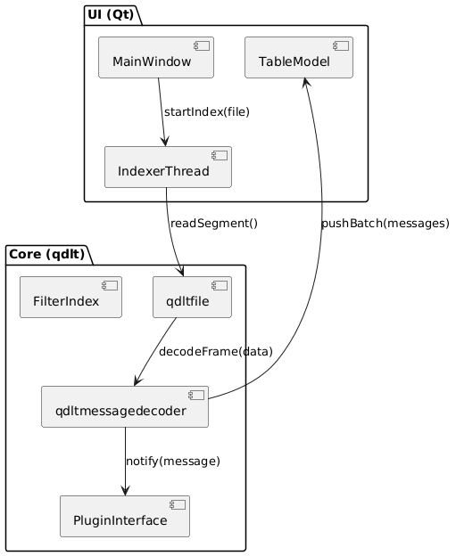
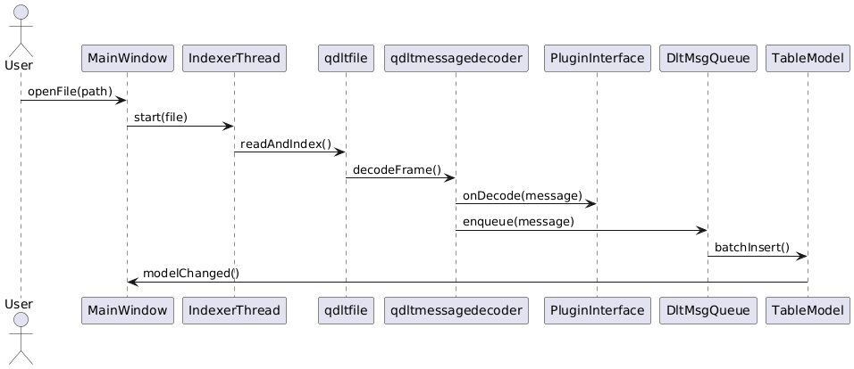
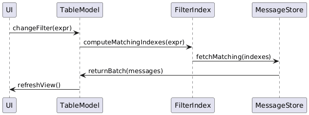
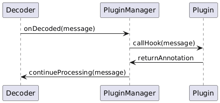

# Low Level Design (LLD) — dlt-viewer

Version: 0.1

Author: Shubham.Shaha@bti.bmwgroup.com

Date: 09-02-2026

This document complements the HLD and gives implementation-level detail for contributors: main modules, key classes, threading rules, data structures, and message lifecycle. It includes PlantUML snippets that live in `doc/` and can be rendered to PNG/SVG for distribution.

Contents
- Purpose
- Architecture Overview (expanded)
- Component Responsibilities
- Data structures & message lifecycle
- Threading & concurrency model
- Interfaces & API contracts
- Error handling & logging
- Performance & caching
- Sequence & behavior diagrams (PlantUML)
- Suggested tests & verification
- Next steps

## 1 Purpose
Provide an implementation-focused reference for contributors: where to add features, expected concurrency rules, and how modules interact at runtime.

## 2 Architecture Overview (expanded)
Core principles:
- Single responsibility per module.
- Clear public boundaries: headers in `qdlt/` represent the public API consumed by the UI and CLI.
- Thread separation: parsing/indexing/decoding run in worker threads; the UI runs on the Qt main thread.

Layers (implementation focus):
- Core (`qdlt/`): file I/O (`qdltfile.*`), decoding (`qdltmessagedecoder.*`), filter evaluation (`qdltfilter*`), plugin host API.
- UI (`src/`, `parser/`): `MainWindow`, `TableModel`, `DltTableView`, filter widgets, indexer controller.
- Plugins (`plugin/`): modules exposing `IPlugin` to register hooks and UI panels.
- CLI (`parser/`, `commander/`): non-GUI tools reusing the core.

## 3 Component Responsibilities (concrete)
Below are concrete responsibilities and example APIs. File names referenced are approximate and map to the repo layout.

- `qdltfile`:
  - Responsibilities: open file, read headers, provide block/segment access and indexing APIs.
  - Example API: `bool open(const std::string &path)`, `Index buildIndex(ProgressCallback)`, `ReadResult readAt(offset, len)`.

- `qdltmessagedecoder`:
  - Responsibilities: decode raw frames into `DLTMessage` objects; handle fragmentation, validation, and timestamp normalization.
  - Example API: `DLTMessage decodeFrame(const uint8_t *data, size_t len)`.

- `qdltfilter*`:
  - Responsibilities: represent predicates, compile expressions, and support fast evaluation via `FilterIndex`.
  - Data model: expression trees (AND/OR/NOT + predicate leafs).

- `IndexerController` / `IndexerThread`:
  - Responsibilities: drive `qdltfile` reads and `MessageDecoder`, emit batches of decoded messages, report progress and support cancellation.

- `DltMsgQueue` / `TableModel`:
  - Responsibilities: receive batches, apply proxy filters, and present rows to the view. Provide thread-safe enqueue and batch insertion APIs.

- `PluginManager`:
  - Responsibilities: discover, load/unload plugins, provide host API, wrap plugin calls with safety and logging.

## 4 Data structures & message lifecycle
- `DLTMessage` (runtime): `timestamp, ecu, context, thread_id, severity, payload_raw, payload_decoded, offset`.
- Index: vector of `IndexEntry { offset, timestamp, message_number }` with checkpointing for fast seek.

Lifecycle summary:
1. Indexer reads file segments from `qdltfile`.
2. Decoder turns frames into `DLTMessage` objects.
3. Messages are offered to `PluginManager` hooks for annotation.
4. Messages are enqueued into `DltMsgQueue` and pushed to `TableModel` in batches.
5. View consumes model data; filters applied by proxy model.

## 5 Threading & concurrency model
- Indexing & decoding run in worker threads (one or a small pool).
- UI updates (QAbstractModel, QWidget) occur on the main Qt thread.
- Use queued signals/slots or `QMetaObject::invokeMethod(..., Qt::QueuedConnection)` when sending batches to the UI.
- Plugin callbacks: may be invoked on worker threads; if plugin touches UI it must dispatch to main thread.

Threading rules (enforce in code and docs):
- `MessageDecoder` methods should be reentrant or have per-thread instances; guard shared resources.
- Plugins must avoid UI access on worker threads; the host should document when callbacks occur and provide helper functions to dispatch to the main thread.

## 6 Interfaces & API contracts
- Public headers: `qdlt/qdlt.h`, `qdlt/qdltfile.h`, `qdlt/qdltmessagedecoder.h`, `qdlt/plugininterface.h`, `qdlt/qdltfilter.h`.
- Example host API (C++):

```cpp
class IHost {
  virtual void registerMessageHook(IMessageHook* hook) = 0;
  virtual void registerPanel(QWidget* panel) = 0;
  virtual Logger* logger() = 0;
};
```

- Common plugin hook signature examples:

```cpp
// called for each decoded message (may be on worker thread)
void onMessage(const DLTMessage &m);

// return a transformed or annotated message
DLTMessage onMessageDecode(DLTMessage &&m);
```

## 7 Error handling & logging
- Use exceptions internally where convenient; convert to error codes on C ABI boundaries.
- Provide a `Logger` interface with levels and make it accessible from the host to plugins and CLI tools.

## 8 Performance & caching
- LRU cache for decoded payloads (see `qdltlrucache.hpp`).
- Batch message delivery to the UI (e.g., 100–500 messages per batch) to reduce UI thrash.
- Index checkpoints (every N messages) for fast seeks and paging.

## 9 Sequence & behavior diagrams (PlantUML)
Render the PlantUML sources under `doc/` (e.g., `doc/architecture.puml`, `doc/lld_architecture.puml`). Sample snippets are shown below and are kept in the repo sources.

Component diagram (PlantUML source in `doc/architecture.puml`)




File Open → Decode → Display (sequence)




Filter evaluation (behavior sequence)



Plugin hook (detailed)




## 10 Suggested tests & verification
- Unit tests: decoder, filters, filter-index correctness.
- Integration: open sample DLT files and verify decoded counts, timestamps and index correctness.
- Plugin tests: load/unload stability and hook invocation count; test that UI dispatching is required for UI-affecting callbacks.
